<h1 align="center">Olá, eu sou Fernando 👋</h1>

  

  <i>Construindo código, bloco por bloco. ⛏️</i>

---

## 🧱 Sobre mim

- 🔭 Atualmente trabalhando em **No Futuro**
- 🌱 Estudando **Java**
- 💬 Pergunte-me sobre **Java**
- 🕷️ Curiosidade: **Sou fã do Homem-Aranha**

## 🎒 Inventário

## 📊 Progresso no mundo

  
  

## 🏗️ Construções em destaque

- [**Nome do projeto**](link) - breve descrição do que ele faz
- [**Outro projeto**](link) - breve descrição

---

  ⛏️ Mundo em construção... novos blocos a caminho

